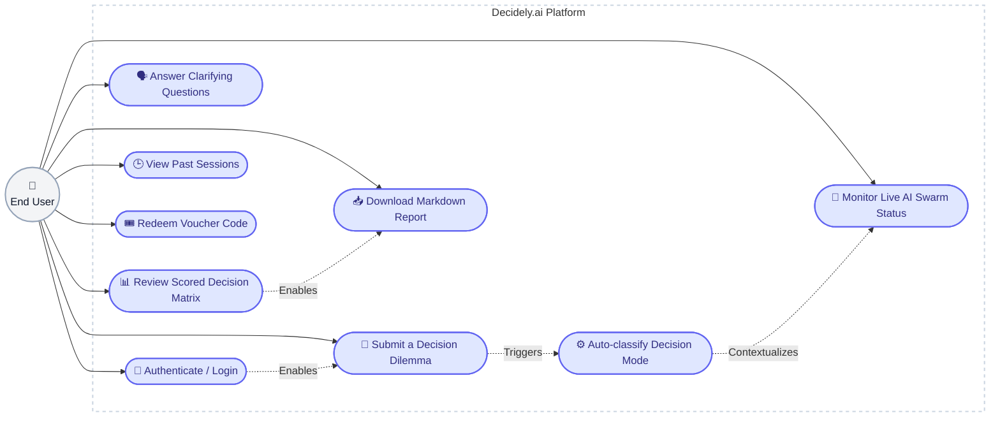
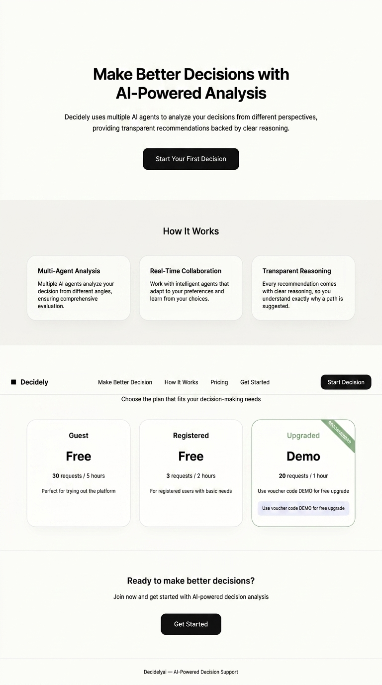
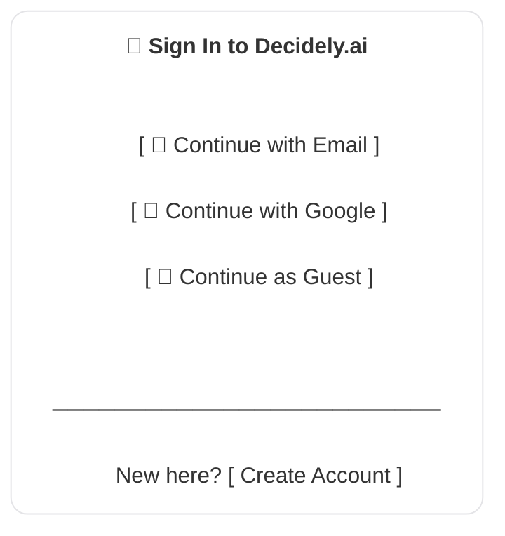
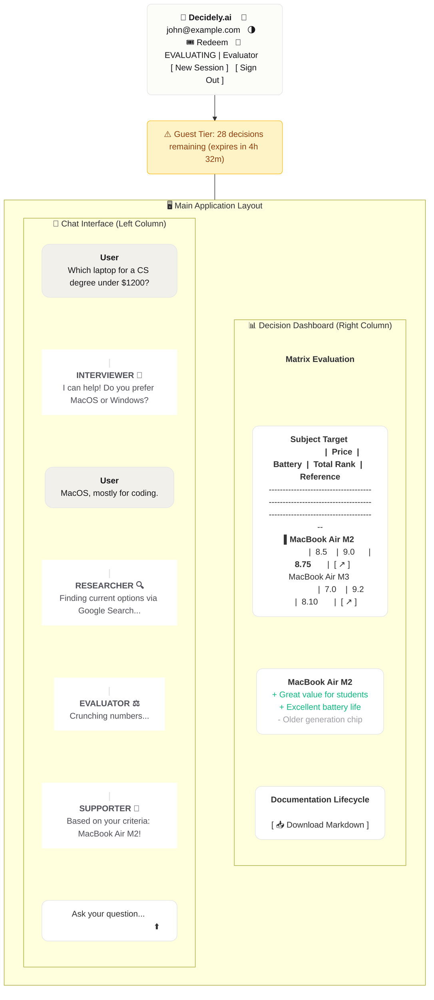
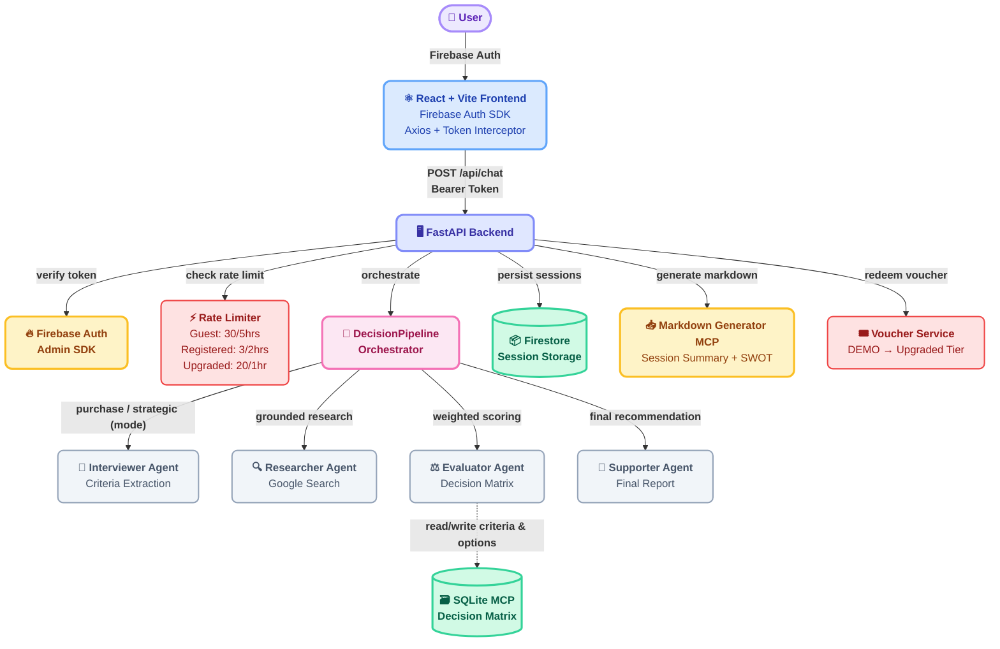

# Decidely.ai

**Multi-agent decision support system powered by Google ADK**

Decidely.ai helps you make confident decisions through a structured AI-guided process — from clarifying your criteria to researching and ranking your options.

## Deployment Link

- Backend(Cloud Run): [Here](https://decidely-ai-backend-2-42922152355.us-central1.run.app)
- Frontend(Github Pages): [Here](https://withered-flowers.github.io/apps-hackathon-genai-apac/)
- Frontend(Cloud Storage): [Here](https://storage.googleapis.com/apps-hackathon-project-adk/index.html)

## Disclaimer

Decidely.ai entire infrastructure is optimized to stay within a **$5/month budget** using only free-tier resources. This means:

- **Cloud SQL is not used** — it has no free tier and would exceed the budget. The decision matrix uses an in-memory SQLite MCP server instead.
- **Cloud Run scales to zero** when idle to avoid baseline compute costs.
- **Firestore Native mode** is used for session storage (generous free tier: 1 GB storage, 50k reads/day).
- **Vertex AI** is used for Gemini models with careful token management to stay within free-tier limits.
- **GitHub Pages** hosts the frontend at zero cost.

Some production best practices (CI/CD pipelines, monitoring, persistent databases) are simplified or omitted to fit the hackathon timeline and budget constraints.

## Use Case Diagram



## Mock UI Layout Diagram

### Landing Page (Unauthenticated Users)

[](documents/assets/landing_page.png)

### Login Page



### Main App (Authenticated Users)



### Mobile Layout

```mermaid
flowchart TB
    classDef header fill:#fcfcf9,stroke:#e4e4e7,stroke-width:1px,color:#18181b,rx:8px,ry:8px
    classDef panel fill:#ffffff,stroke:#e4e4e7,stroke-width:1px,rx:12px,ry:12px
    classDef drawer fill:#f1f0eb,stroke:#e4e4e7,stroke-width:1px,rx:0px,ry:0px

    NavMobile["<b>🧠 Decidely.ai</b> &nbsp;&nbsp;&nbsp;&nbsp;&nbsp;&nbsp; [ ☰ Menu ]"]:::header

    subgraph MobileContent ["📱 Mobile View"]
        direction TB
        ChatMobile["<b>Chat</b><br/><br/>User message<br/>AI Response<br/><br/><input>Ask...</input>"]:::panel

        Drawer["<b>☰ Menu</b><br/>──────────<br/>📊 Matrix<br/>🕒 History<br/>🎟️ Redeem<br/>🌗 Theme<br/>──────────<br/>[ New Session ]<br/>[ Sign Out ]"]:::drawer
    end

    NavMobile --> MobileContent
    MobileContent --- Drawer
```



## Adaptive Decision Modes

The decision pipeline features an **Adaptive Classifier** that automatically categorizes the user's initial dilemma to optimize downstream agent behavior. The classification is locked for the duration of the session and dictates the entire swarm's approach:

1. **Purchase Mode** (`decision_type = "purchase"`)
   - **Triggered by**: Requests to buy specific products or services with personal/consumer language or price caps (e.g., *"Which laptop should I buy under $1200?"*).
   - **Agent Behavior**: The swarm focuses on finding specific, actionable, and buyable options. The Researcher identifies direct product matches, and the Evaluator ranks them based on cost and consumer features.
   - **Performance**: Optimized with a rapid 30-second execution timeout.

2. **Strategic Mode** (`decision_type = "strategic"`)
   - **Triggered by**: Organizational language, long-term impact decisions, or complex vendor evaluations (e.g., *"Should we migrate from GCP to AWS?"*).
   - **Agent Behavior**: The swarm shifts to multi-dimensional analysis. The Researcher explores distinct strategic paths, focusing on Total Cost of Ownership (TCO), risks, compliance, and vendor lock-in, rather than simple product listings.
   - **Performance**: Granted an extended 90-second execution timeout for deep research.

Additionally, the classifier determines a **Decision Domain** (`finance`, `infrastructure`, or `general`), which is injected into the prompt of every downstream agent (Interviewer, Researcher, Evaluator, Supporter) to ensure highly contextualized responses.

## Architecture



## Tech Stack

| Layer | Technology |
|-------|-----------|
| Backend | Python 3.11+, Google ADK, FastAPI, uv |
| Frontend | React 19, Vite 8, Tailwind CSS, Bun |
| AI Agents | Gemini 3.1 Flash Lite (Preview) via Google ADK (Vertex) |
| Authentication | Firebase Auth (Email/Password, Google OAuth, Anonymous) |
| Storage | Google Cloud Firestore |
| Decision Matrix | SQLite via MCP |
| Report Export | Markdown Generator MCP |
| Rate Limiting | Token bucket per user tier (Guest/Registered/Upgraded) |
| Deployment | Cloud Run (backend), GitHub Pages (frontend), Cloud Storage (frontend) |

## Prerequisites

- Python 3.11+
- Bun v1.3+
- Google Cloud Project with Firestore and Vertex AI API enabled
- Firebase project with Authentication enabled (Email/Password, Google OAuth, Anonymous)
- `gcloud auth application-default login`

## Quick Start (Development)

### Backend

```bash
cd backend
cp .env.example .env
# Edit .env — set GOOGLE_CLOUD_PROJECT
uv sync
uv run uvicorn app.api.main:app --reload
```

Server starts at <http://localhost:8000>. Docs at <http://localhost:8000/docs>.

### Frontend

```bash
cd frontend
bun install
bun run dev
```

App starts at <http://localhost:5173>.

## Usage

1. Open `http://localhost:5173`
2. Type a decision query (e.g. "Which laptop should I buy for $1000?")
3. Answer the Interviewer agent's clarifying questions
4. Watch the Researcher find current options via Google Search
5. See the Evaluator produce a weighted comparison matrix
6. Receive the Supporter's final recommendation
7. Click **Download Report as Markdown** to save your decision report

## Project Structure

```
backend/
├── app/
│   ├── agents/          # ADK Agent definitions
│   │   ├── primary.py       # DecisionPipeline orchestrator
│   │   ├── interviewer.py   # Criteria extraction
│   │   ├── researcher.py    # Google Search grounding
│   │   ├── evaluator.py     # Weighted scoring matrix
│   │   └── supporter.py     # Final recommendation
│   ├── mcp/             # MCP clients (SQLite, Markdown Generator)
│   ├── core/            # Config, Firebase Auth, Firestore, rate limiter, logging
│   ├── api/             # FastAPI routes
│   ├── models/          # Pydantic schemas & entities
│   └── services/        # Decision, report, voucher services
├── tests/
└── pyproject.toml

frontend/
├── src/
│   ├── components/      # React UI components (LandingPage, Chat, Matrix, etc.)
│   ├── context/         # AuthContext (Firebase Auth provider)
│   ├── services/        # API client with auth interceptor + SSE streaming
│   ├── App.jsx          # Root application with conditional routing
│   └── main.jsx
└── package.json
```

## API Endpoints

| Method | Path | Description |
|--------|------|-------------|
| `POST` | `/api/chat` | Send a message, advance the decision pipeline |
| `POST` | `/api/chat/stream` | Stream real-time agent status updates via SSE |
| `GET` | `/api/history/{session_id}` | Get conversation history (ownership verified) |
| `GET` | `/api/session/new` | Generate a new session ID |
| `GET` | `/api/sessions/recent` | List the 5 most recent sessions |
| `POST` | `/api/export/{session_id}` | Export report to Google Drive |
| `GET` | `/api/export/{session_id}/download` | Download report as markdown file |
| `POST` | `/api/voucher/redeem` | Redeem voucher code for upgraded tier |
| `GET` | `/api/user/status` | Get user's rate limit tier and upgrade status |
| `GET` | `/health` | Health check |

## Notes for Reviewers

- **Budget**: Targets <$5/month on Cloud Run (scale-to-zero) + Firestore free tier
- **Authentication**: Firebase Auth with email/password, Google OAuth, and anonymous guest login
- **MCP**: SQLite MCP for decision matrix storage, Markdown Generator for reports
- **ADK**: DecisionPipeline orchestrator in `app/agents/primary.py` with adaptive modes (purchase/strategic)
- **Context**: Multi-turn context maintained via session state in Firestore
- **Rate Limiting**: Token bucket per tier — Guest (30/5hrs), Registered (3/2hrs), Upgraded (20/1hr)
- **Voucher System**: DEMO code upgrades to Upgraded tier
- **FR-008**: Multiple concurrent decision threads is deferred — default `user_id` is `"anonymous"`
