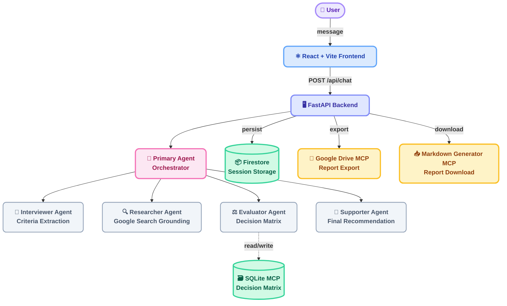

# Decidely.ai

**Multi-agent decision support system powered by Google ADK**

Decidely.ai helps you make confident decisions through a structured AI-guided process — from clarifying your criteria to researching and ranking your options.

## Disclaimer

Decidely.ai entire infrastructure is optimized to stay within a **$5/month budget** using only free-tier resources. This means:

- **Cloud SQL is not used** — it has no free tier and would exceed the budget. The decision matrix uses an in-memory SQLite MCP server instead.
- **Cloud Run scales to zero** when idle to avoid baseline compute costs.
- **Firestore Native mode** is used for session storage (generous free tier: 1 GB storage, 50k reads/day).
- **Vertex AI** is used for Gemini models with careful token management to stay within free-tier limits.
- **GitHub Pages** hosts the frontend at zero cost.

Some production best practices (CI/CD pipelines, monitoring, persistent databases) are simplified or omitted to fit the hackathon timeline and budget constraints.

## Architecture



## Tech Stack

| Layer | Technology |
|-------|-----------|
| Backend | Python 3.11+, Google ADK, FastAPI, uv |
| Frontend | React 19, Vite 8, Tailwind CSS, Bun |
| AI Agents | Gemini 2.0 Flash via Google ADK |
| Storage | Google Cloud Firestore |
| Decision Matrix | SQLite via MCP |
| Report Export | Google Drive via MCP, Markdown Generator MCP |
| Deployment | Cloud Run (backend), GitHub Pages (frontend) |

## Prerequisites

- Python 3.11+
- Bun v1.3+
- Google Cloud Project with Firestore and Vertex AI API enabled
- `gcloud auth application-default login`

## Quick Start

### Backend

```bash
cd backend
cp .env.example .env
# Edit .env — set GOOGLE_CLOUD_PROJECT
uv sync
uv run uvicorn app.api.main:app --reload
```

Server starts at <http://localhost:8000>. Docs at <http://localhost:8000/docs>.

### Frontend

```bash
cd frontend
bun install
bun run dev
```

App starts at <http://localhost:5173>.

## Usage

1. Open `http://localhost:5173`
2. Type a decision query (e.g. "Which laptop should I buy for $1000?")
3. Answer the Interviewer agent's clarifying questions
4. Watch the Researcher find current options via Google Search
5. See the Evaluator produce a weighted comparison matrix
6. Receive the Supporter's final recommendation
7. Click **Download Report as Markdown** to save your decision report

## Project Structure

```
backend/
├── app/
│   ├── agents/          # ADK Agent definitions
│   │   ├── primary.py   # Supervisor orchestrator
│   │   ├── interviewer.py
│   │   ├── researcher.py
│   │   ├── evaluator.py
│   │   └── supporter.py
│   ├── mcp/             # MCP clients (SQLite, Drive, Markdown Generator)
│   ├── core/            # Config, Firestore, logging, errors
│   ├── api/             # FastAPI routes
│   ├── models/          # Pydantic schemas & entities
│   └── services/        # Business logic
└── pyproject.toml

frontend/
├── src/
│   ├── components/      # React UI components
│   ├── services/        # API client (axios)
│   └── App.jsx          # Root application
└── package.json

specs/001-decidely-ai-core/  # Design artifacts
```

## API Endpoints

| Method | Path | Description |
|--------|------|-------------|
| `POST` | `/api/chat` | Send a message, advance the pipeline |
| `POST` | `/api/chat/stream` | Stream real-time agent status updates via SSE |
| `GET` | `/api/history/{session_id}` | Get conversation history |
| `GET` | `/api/session/new` | Generate a new session ID |
| `GET` | `/api/sessions/recent` | List the 5 most recent sessions |
| `POST` | `/api/export/{session_id}` | Export report to Google Drive |
| `GET` | `/api/export/{session_id}/download` | Download report as markdown file |
| `GET` | `/health` | Health check |

## Notes for Reviewers

- **Budget**: Targets <$5/month on Cloud Run (scale-to-zero) + Firestore free tier
- **MCP**: SQLite MCP is used for the decision matrix (FR-005), Drive MCP for export (US2)
- **ADK**: Supervisor Pattern implemented in `app/agents/primary.py` (FR-001)
- **Context**: Multi-turn context maintained via session state in Firestore (FR-002)
- **FR-008**: Multiple concurrent decision threads is deferred — default `user_id` is `"anonymous"`
